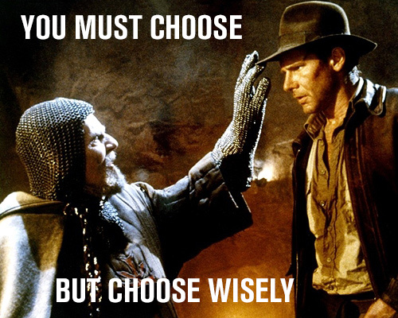

# CivicSource Development Interview

There are two tests in this repo designed to get a quick grasp of your dev abilities. [Create a `solution` branch](https://help.github.com/articles/creating-and-deleting-branches-within-your-repository/) in this repo and [submit a pull request](https://help.github.com/articles/using-pull-requests/) when you are done.

Each test has a list of tasks to complete. Complete as many tasks as you can. Be sure to explain your solution, what you didn't get to, any problems you faced, and any other relevant information in your [pull request](https://help.github.com/articles/using-pull-requests/).

There is a [front end](frontend) & a [backend](backend) test. Choose which one you would like to do.

